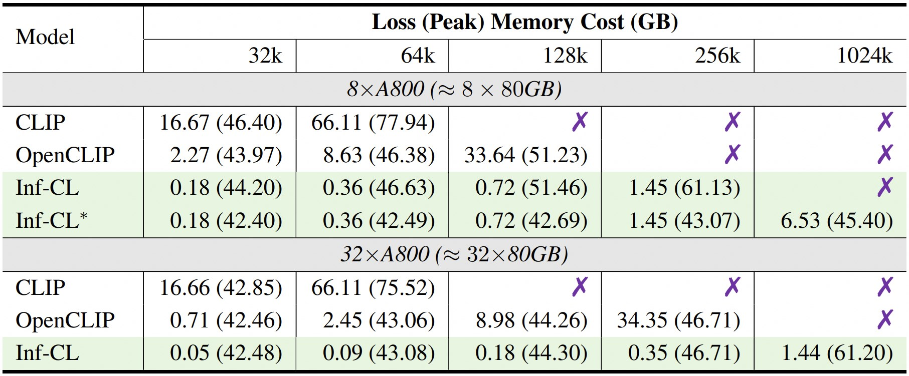
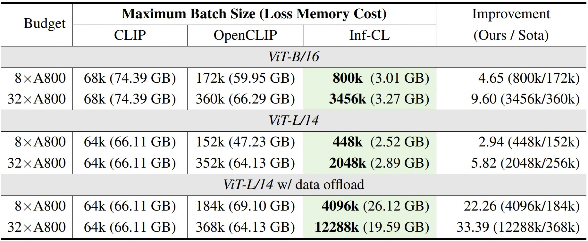
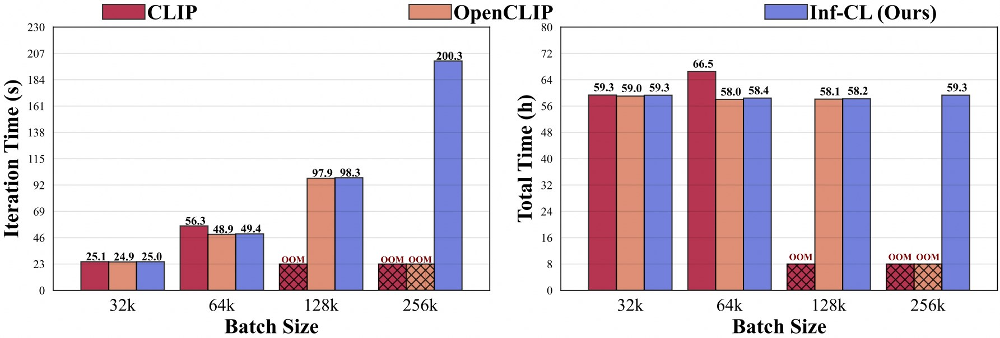
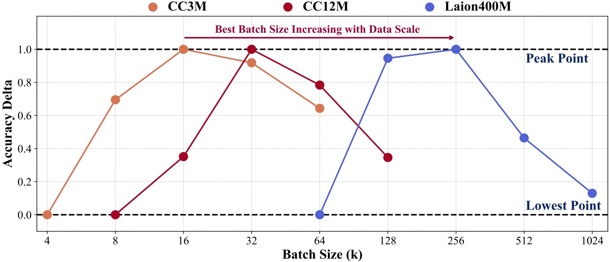

## This fork implements Geometric Parametrization for Inf-CLIP
- Early work in progress
- Experimental and untested modification of Inf-CLIP (I don't have access to distributed multi-GPU instances).
- May or may not produce the excellent results seen with my normal [zer0int/CLIP-fine-tune](https://github.com/zer0int/CLIP-fine-tune).
----
To use:
1. Load an OpenAI CLIP model, convert to Geometric Parametrization (GmP), save - with:
- `convert-openai-clip-to-gmp.py`
2. Run CLIP training with args (for example):
- `--pretrained ViT-L-14-GmP.pt --model ViT-L-14`

-------
### Original README.md below
--------
<p align="center">
    
<p>

<h3 align="center"><a href="https://arxiv.org/abs/2410.17243">
Breaking the Memory Barrier: Near Infinite Batch Size Scaling for Contrastive Loss</a></h3>
<h5 align="center"> If our project helps you, please give us a star ⭐ on GitHub to support us. 🙏🙏 </h2>

<h5 align="center">

[](https://arxiv.org/abs/2410.17243)
[](https://pypi.org/project/inf-cl) <br>
[](https://github.com/DAMO-NLP-SG/Inf-CLIP/blob/main/LICENSE)
[](https://hits.seeyoufarm.com)
[](https://github.com/DAMO-NLP-SG/Inf-CLIP/issues?q=is%3Aopen+is%3Aissue)
[](https://github.com/DAMO-NLP-SG/Inf-CLIP/issues?q=is%3Aissue+is%3Aclosed)  <br>
[](https://zhuanlan.zhihu.com/p/1681887214)
[](https://x.com/lixin4ever/status/1849669129613226457) <br>

</h5>

<div align="center"></div>

<details open><summary>💡 Some other multimodal foundation model projects from our team may interest you ✨. </summary><p>
<!--  may -->

> [**Video-LLaMA: An Instruction-tuned Audio-Visual Language Model for Video Understanding**](https://github.com/DAMO-NLP-SG/Video-LLaMA) <br>
> Hang Zhang, Xin Li, Lidong Bing <br>
[](https://github.com/DAMO-NLP-SG/Video-LLaMA)  [](https://github.com/DAMO-NLP-SG/Video-LLaMA) [](https://arxiv.org/abs/2306.02858) <br>

> [**VCD: Mitigating Object Hallucinations in Large Vision-Language Models through Visual Contrastive Decoding**](https://arxiv.org/abs/2311.16922) <br>
> Sicong Leng, Hang Zhang, Guanzheng Chen, Xin Li, Shijian Lu, Chunyan Miao, Lidong Bing <br>
[](https://github.com/DAMO-NLP-SG/VCD)  [](https://github.com/DAMO-NLP-SG/VCD)  [](https://arxiv.org/abs/2311.16922) <br>

> [**VideoLLaMA 2: Advancing Spatial-Temporal Modeling and Audio Understanding in Video-LLMs**](https://github.com/DAMO-NLP-SG/VideoLLaMA2) <br>
> Zesen Cheng, Sicong Leng, Hang Zhang, Yifei Xin, Xin Li, Guanzheng Chen, Yongxin Zhu, Wenqi Zhang, Ziyang Luo, Deli Zhao, Lidong Bing <br>
[](https://github.com/DAMO-NLP-SG/VideoLLaMA2)  [](https://github.com/DAMO-NLP-SG/VideoLLaMA2) [](https://arxiv.org/abs/2406.07476) <br>

> [**The Curse of Multi-Modalities: Evaluating Hallucinations of Large Multimodal Models across Language, Visual, and Audio**](https://arxiv.org/abs/2410.12787) <br>
> Sicong Leng, Yun Xing, Zesen Cheng, Yang Zhou, Hang Zhang, Xin Li, Deli Zhao, Shijian Lu, Chunyan Miao, Lidong Bing <br>
[](https://github.com/DAMO-NLP-SG/CMM)  [](https://github.com/DAMO-NLP-SG/CMM)  [](https://arxiv.org/abs/2410.12787) <br>

</p></details>

## 📰 News
* **[2024.10.18]**  Release training, evaluation codes of Inf-CLIP.

<div align="center"></div>

## 🛠️ Requirements and Installation

Basic Dependencies:
* Python >= 3.8
* Pytorch >= 2.0.0
* CUDA Version >= 11.8

[Remote] Install Inf-CL:
```bash
# remote installing
pip install inf_cl -i https://pypi.org/simple
```

[Local] Install Inf-CL:
```bash
pip install -e .
```

Install required packages:
```bash
git clone https://github.com/DAMO-NLP-SG/Inf-CLIP
cd Inf-CLIP
pip install -r requirements.txt
```

## ⭐ Features

`inf_cl` is the triton implementation of Inf-CL loss:
* [x] [Ring-CL (inf_cl/ring.py#L238)](https://github.com/DAMO-NLP-SG/Inf-CLIP/blob/main/inf_clip/models/ops/ring.py#L238)
* [x] [Inf-CL  (inf_cl/ring.py#L251)](https://github.com/DAMO-NLP-SG/Inf-CLIP/blob/main/inf_clip/models/ops/ring.py#L251)

`inf_clip` is the CLIP training codebase with Inf-CL loss and other training features:
- [x] [Gradient Accumulation (inf_clip/train/train.py#L180)](https://github.com/DAMO-NLP-SG/Inf-CLIP/inf_clip_train/train.py#L180)
- [x] [Gradient Cache (inf_clip/train/train.py#L292)](https://github.com/DAMO-NLP-SG/Inf-CLIP/blob/main/inf_clip_train/train.py#L292)


## 🔑 Usage

A simple example about how to adopt our Inf-CL loss for contrastive learning. Using such command for attempting:
```
torchrun --nproc_per_node 2 tests/example.py
```

```python
import torch
import torch.nn.functional as F
import torch.distributed as dist
import numpy as np

from inf_cl import cal_inf_loss


def create_cl_tensors(rank, world_size):
    # Parameters
    dtype = torch.float32
    num_heads = 3        # Number of attention heads
    seq_length_q = 32768 # Sequence length
    seq_length_k = 32768
    d_model = 256        # Dimension of each head (must be 16, 32, 64, or 128)

    # Randomly initialize inputs
    q = torch.rand((seq_length_q // world_size, num_heads * d_model), dtype=dtype, device=f"cuda:{rank}")
    k = torch.rand((seq_length_k // world_size, num_heads * d_model), dtype=dtype, device=f"cuda:{rank}")
    l = torch.ones([], dtype=dtype, device=f"cuda:{rank}") * np.log(1 / 0.07)

    q = F.normalize(q, p=2, dim=-1).requires_grad_() # Query
    k = F.normalize(k, p=2, dim=-1).requires_grad_() # Key
    l = l.requires_grad_() # Logit scale

    return q, k, l


if __name__ == "__main__":
    # Assume that the distributed environment has been initialized
    dist.init_process_group("nccl")

    rank = dist.get_rank()
    world_size = dist.get_world_size()

    torch.cuda.set_device(rank)

    # Exampled by Image-Text Contrastive Learning, q is the global image features, 
    # k is the text features, and l is the logit scale.
    q, k, l = create_cl_tensors(rank, world_size)

    # labels are diagonal elements by default. 
    # labels = torch.arange(q.shape[0])
    loss = cal_inf_loss(q, k, scale=l.exp())

    print(loss)

```

## 🚀 Main Results

### Memory Cost
<p></p>

\* denotes adopting "data offload" strategy. 

### Max Supported Batch Size
<p></p>

### Speed
<p></p>

### Batch Size Scaling
<p></p>

Training with larger data scale needs larger batch size.

## 🗝️ Training & Evaluation

### Quick Start

To facilitate further development on top of our codebase, we provide a quick-start guide on how to use Inf-CLIP to train a customized CLIP and evaluate the trained model on the mainstream clip benchmarks.

1. Training Data Structure:
```bash
Inf-CLIP
├── datasets
│   ├── cc3m/ # https://github.com/rom1504/img2dataset/blob/main/dataset_examples/cc3m.md
|   |   ├── 0000.tar
|   |   ├── 0001.tar
|   |   ├── ...
|   |   └── 0301.tar
│   ├── cc12m/ # https://github.com/rom1504/img2dataset/blob/main/dataset_examples/cc12m.md
|   |   ├── 0000.tar
|   |   ├── 0001.tar
|   |   ├── ...
|   |   └── 1044.tar
│   ├── laion400m/ # https://github.com/rom1504/img2dataset/blob/main/dataset_examples/laion400m.md
|   |   ├── 00000.tar
|   |   ├── 00001.tar
|   |   ├── ...
|   |   └── 41407.tar
```
2. Command:
```bash
bash scripts/cc3m/lit_vit-b-32_bs16k.sh
bash scripts/cc12m/lit_vit-b-32_bs32k.sh
bash scripts/laion400m/lit_vit-b-32_bs256k.sh
```
3. Evaluation Data Structure:
```bash
Inf-CLIP
├── datasets
│   ├── imagenet-1k/ # download val_images.tar.gz of imagenet
|   |   └── val/
|   |   |   ├── n01440764
|   |   |   ├── n01443537
|   |   |   ├── ...
|   |   |   └── n15075141
│   ├── clip-benchmark/ # bash datasets/benchmarks_download.sh
|   |   ├── wds_mscoco_captions
|   |   ├── wds_flickr8k
|   |   ├── wds_flickr30k
|   |   ├── wds_imagenet1k
|   |   ├── wds_imagenetv2
|   |   ├── wds_imagenet_sketch
|   |   ├── wds_imagenet-a
|   |   ├── wds_imagenet-r
|   |   ├── wds_imagenet-o
|   |   └── wds_objectnet
```
4. Command:
```bash
# imagenet evaluation
bash scripts/imagenet_eval.sh
# overall evaluation
bash scripts/benchmarks_eval.sh
```

## 📑 Citation

If you find Inf-CLIP useful for your research and applications, please cite using this BibTeX:
```bibtex
@article{damovl2024infcl,
  title={Breaking the Memory Barrier: Near Infinite Batch Size Scaling for Contrastive Loss},
  author={Zesen Cheng, Hang Zhang, Kehan Li, Sicong Leng, Zhiqiang Hu, Fei Wu, Deli Zhao, Xin Li, Lidong Bing},
  journal={arXiv preprint arXiv:2410.17243},
  year={2024},
  url={https://arxiv.org/abs/2410.12787}
}
```

## 👍 Acknowledgement
The codebase of Inf-CLIP is adapted from [**OpenCLIP**](https://github.com/mlfoundations/open_clip). We are also grateful for the following projects our Inf-CL arise from:
* [**OpenAI CLIP**](https://openai.com/index/clip/), [**img2dataset**](https://github.com/rom1504/img2dataset), [**CLIP-Benchmark**](https://github.com/LAION-AI/CLIP_benchmark).
* [**FlashAttention**](https://github.com/Dao-AILab/flash-attention), [**RingAttention**](https://github.com/haoliuhl/ringattention), [**RingFlashAttention**](https://github.com/zhuzilin/ring-flash-attention). 


## 🔒 License

This project is released under the Apache 2.0 license as found in the LICENSE file.
The service is a research preview intended for **non-commercial use ONLY**, subject to the model Licenses of CLIP, Terms of Use of the data generated by OpenAI, and Laion. Please get in touch with us if you find any potential violations.
